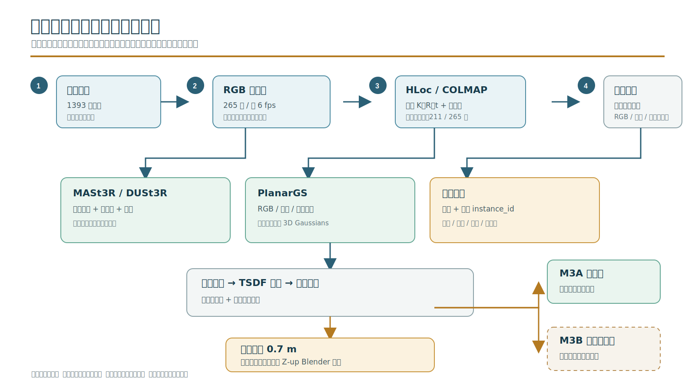
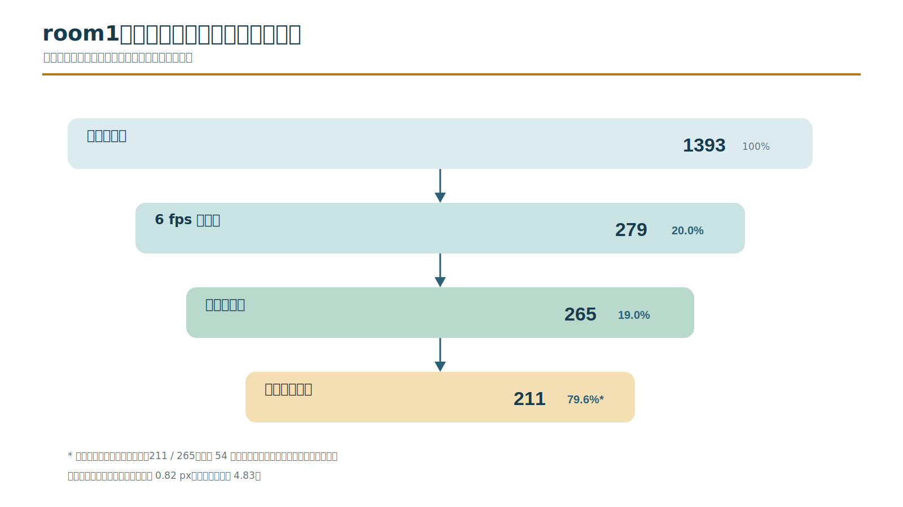
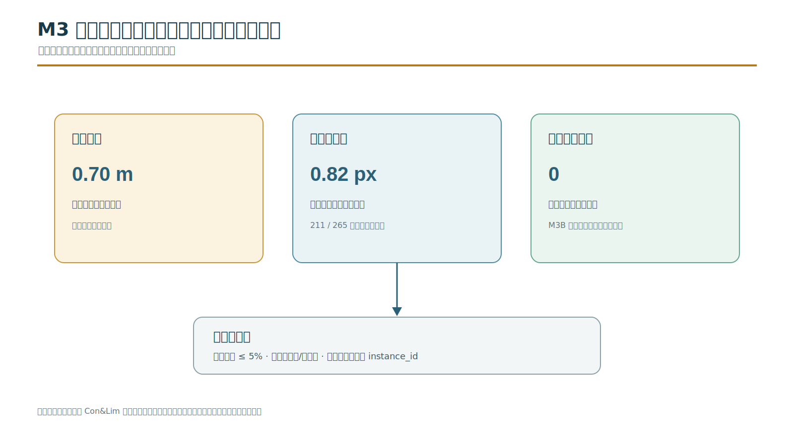

# Room1 Indoor Video Scene Reconstruction

从一段手持手机视频恢复可度量、可导出并可继续编辑的室内三维场景。这里保存的是
2026-07-23 云端 A100 执行源码快照、精确依赖版本、结果元数据和展示材料。



## Pipeline

```text
video
  -> keyframe selection
  -> HLoc feature matching + COLMAP SfM
  -> MASt3R/DUSt3R dense geometry priors
  -> confidence and scale alignment
  -> PlanarGS optimization
  -> rendered depth + TSDF fusion
  -> semantic metric calibration
  -> metric PLY/GLB and collision proxy
```

COLMAP 提供全局一致但稀疏的相机几何，MASt3R/DUSt3R 提供稠密深度先验；
二者先做尺度和坐标对齐，再以置信度软约束 PlanarGS。最终场景使用灰色沙发
左右扶手外侧宽度 `0.7 m` 建立唯一的全局等比例尺度，并转换到右手、Z-up、
单位为米的 Blender 世界坐标。

## Validated Room1 Result

| Item | Value |
|---|---:|
| Original video frames | 1,393 |
| Strict keyframes | 265 |
| Main COLMAP model registrations | 211 / 265 |
| Mean reprojection error | about 0.82 px |
| PlanarGS optimization | 30,000 iterations |
| Training PSNR | about 28.80 dB |
| TSDF vertices | 957,204 |
| TSDF triangles | 1,871,242 |
| Connected components | 16 |
| Largest component share | 98.40% |
| Metric anchor | sofa outer width = 0.700 m |
| Uniform scale | 0.1467856232 m / COLMAP unit |




## Repository Contents

- `scripts/m3_room1_repair_v2/`: successful repair pipeline and final M3A exporters.
- `scripts/m3_room1/`: earlier M3 orchestration, review and validation utilities.
- `scripts/*.sh` and `scripts/*.py`: deployment, model smoke tests and PlanarGS helpers.
- `environment/`: exact upstream commits, GPU identity and Python package snapshots.
- `examples/room1/`: camera poses, scale report, manifest and output checksums.
- `assets/`: diagrams and Blender geometry previews.
- `docs/`: reproduction notes, validated findings and limitations.

The scripts preserve the actual cloud run and therefore several paths default to
`/root/scene_recon`. Read [Reproducibility](docs/REPRODUCIBILITY.md) before using
them on another machine.

## Output Scope

M3A is the complete conservative scene: no semantic object exclusion mask was applied.
The collision GLB is a simplified geometric proxy, not an engine-specific physics
component. M3B object removal remains a separately reviewed stage and is not claimed as
complete in this snapshot.

The raw MP4, checkpoints, private room images, dense PLY/GLB meshes and server logs are
intentionally excluded. `examples/room1/checksums.sha256` records the validated private
M3A artifacts without placing them in Git history.

## Source Snapshot

The private cloud-source archive was downloaded before container retirement:

```text
room1_source_snapshot_20260723_slim.tar.gz
SHA256 1bbc4689e045260b43365dd06ad7923348bda67f4746d3a04a1f0b6d081ab14a
```

Only the reviewed source and metadata subset is committed here.

## Third-Party Work

HLoc, COLMAP, MASt3R/DUSt3R, PlanarGS, GroundingDINO, SAM, Open3D and Blender are
third-party projects. Their algorithms are not claimed as original work. Exact repository
commits are recorded in [THIRD_PARTY.md](THIRD_PARTY.md).
